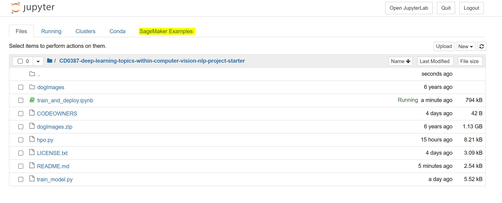

# Dog Type Image Classification using AWS SageMaker
In this project, we use AWS Sagemaker to train a pretrained model that can perform image classification by using the Sagemaker profiling, debugger, hyperparameter tuning and other good ML engineering practices.

## Project Set Up
The jupyter notebook "train_and_deploy.ipynb" is the backbone of the project, works as a sagemaker notebook instance and is inspired from two main sources:   
1- The repo provided by Udacity [repo](https://github.com/udacity/CD0387-deep-learning-topics-within-computer-vision-nlp-project-starter)       
2- sagemaker notebook example "hpo_image_classification_warmstart.ipynb" provided by aws. Start a sagemaker notebook instance, click on "Open Jupyter", go to sagemaker examples, go to hyperparameter tuning. See the following screenshots for more illustration.



For more explanation, see this official aws video tutorial: https://www.youtube.com/watch?v=xpZFNIOaQns

## Dataset
The provided dataset is the dogbreed classification dataset which can be found [here](https://learn.udacity.com/nanodegrees/nd189/parts/cd0387/lessons/7c09e0ea-e598-4120-a539-7d44b55233d1/concepts/010e0a20-a936-4a3b-a5f5-89dc2e04cff9).
The dataset has 3 folders: train, test and valid. The number of dog classes is 133. The size of the images are variable and different. The dataset format is folders having the dog classes names, each class or folder consits of jpg images. Train dataset consists of 888 images; the test dataset consists of 836 images; the validation dataset consists of 835 images.

### Access
The data are downloaded locally with sagemaker notebook and then uploaded to an S3 bucket through the AWS Gateway so that SageMaker has access to the data. 

## Hyperparameter Tuning

**Pretrained model used:** image-classification version 1 from Docker     
**Why image-classification version 1?**
1. Supports content type image/jpeg and application/x-image which is quite suitable for the dog dataset having jpeg images and the indeces of the classes are ready-indexed in the names of the folders.
2. Uses a convolutional neural network, therefore, compatible with the topics we are learning.
3. A pre-trained model, one of the main requirements of the projects, and suitable for our dataset that consits of only few images in each class.
4. Well-documented.

For more information: https://docs.aws.amazon.com/sagemaker/latest/dg/image-classification.html  


**Tuned Hyperparameters:**
* static hyperparameter set to the model:
1. num_layers='18',
2. num_classes='133',
3. num_training_samples='7980',#60 images fer each class * 133 classes
4. mini_batch_size='128',
5. epochs='10',
6. top_k="2",
7. precision_dtype="float32",
8. augmentation_type="crop",

* mutable hyperparameters set to the model to search for the best therough their ranges:
1. "eps": ContinuousParameter(0, 1)
2. "learning_rate": ContinuousParameter(0.001, 0.1),
3. "momentum": ContinuousParameter(0, 1),
4. "optimizer": CategoricalParameter(["adam", "sgd", "rmsprop"]), 
5. "weight_decay": ContinuousParameter(0.0, 0.99),

## Training job:

      

      

  

4 training jobs are created with the following hyperparameters and accuracy:    

| **eps** | **learning_rate** | **momentum** | **optimizer** | **weight_decay** | **TrainingJobName** | **TrainingJobStatus** | **FinalObjectiveValue** | **TrainingStartTime** |
|---|---|---|---|---|---|---|---|---|
| 0.944849 | 0.046427 | 0.829490 | adam | 0.684004 | hyperparameters-tuning-job-33-004-852e0853 | Completed | 0.029948 | 2023-02-25 15:33:27+00:00 |
| 0.669710 | 0.054404 | 0.397470 | adam | 0.988658 | hyperparameters-tuning-job-33-001-ac2a98c4 | Completed | 0.018229 | 2023-02-25 15:14:04+00:00 |
| 0.362381 | 0.003090 | 0.079847 | sgd | 0.977134 | hyperparameters-tuning-job-33-003-cb68f8fc | Completed | 0.013021 | 2023-02-25 15:28:13+00:00 |
| 0.210714 | 0.002270 | 0.093384 | rmsprop | 0.824209 | hyperparameters-tuning-job-33-002-0cb7a40c | Completed | 0.009115 | 2023-02-25 15:22:58+00:00 |


The graph above shows that the best training job is the last one.

## Debugging and Profiling
- In fit method: log=True
- After getting the best estimator we showed the processor and memory usage by: sagemaker.Session().logs_for_job
- Exported logs into the s3 bucket
- Before exporting, 3 permissions should be given:
1. permission given to sagemaker to access cloud watch:
Go to aws roles --> choose AmazonSageMaker-ExecutionRole-20230220T065503 --> attach policy --> CloudWatchLogsFullAccess 
2. permission given to s3 to allow cloud watch to write on it:         
Go to S3 --> choose dog-images-uploaded-from-sagemaker --> Go to permissions tab --> bucket policy --> edit:  
```    
{    
    "Version": "2012-10-17",     
    "Statement": [    
        {     
            "Effect": "Allow",       
            "Principal": {       
                "Service": "logs.us-east-1.amazonaws.com"    
            },      
            "Action": [     
                "s3:GetBucketAcl",   
                "s3:PutObject"     
            ],      
            "Resource": [   
                "arn:aws:s3:::dog-images-uploaded-from-sagemaker",
                "arn:aws:s3:::dog-images-uploaded-from-sagemaker/*"
            ]
        }
    ]
}
```


## Model Deployment


